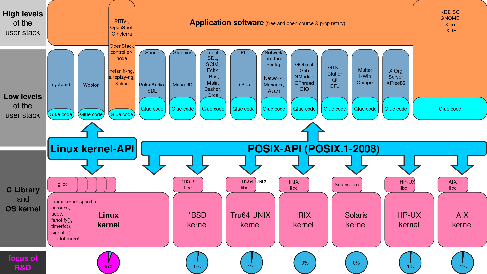

<!SLIDE title-slide>
# Pentest-TO: The Pentester's Study Group

## Session 1: Theory, Mindset and Tools

> “If the mind is to emerge unscathed from this relentless struggle with the unforeseen, two qualities are indispensable: first, an intellect that, even in the darkest hour, retains some glimmerings of the inner light which leads to truth; and second, the courage to follow this faint light wherever it may lead.” - Carl von Clauswitz, 'On War'

Weltgeist ( weltgeist@protonmail.com )

Monday September 12th, 2016

<!SLIDE>
# Goals of the Group

1. Develop practical skills as penetration testers.
2. Develop a theoretical and intuitive sense of computer, mobile, and embedded systems security.
3. (Optional) Develop skills as exploit research and development, and reverse engineers.
4. Longer-term goal: building a volunteer red team and its technical supporting team. Intended for testing open source community systems like [TOMesh](https://tomesh.net/), participation in competitions, giving talks and workshops, publications, etc.
5. Having fun, empowerment, and becoming 1337.

<!SLIDE>
# DISCLAIMER: What we **won't** be doing

- We will not be doing anything illegal: **Don't exploit what you don't own, or explicitly have permission to test.** All of our labs will be on our own machines, or systems we've set up as a group.
- We will not be teaching you how commit computer/cyber-crime or otherwise break the law.
- We will not be doing things that will get our venue host's network flagged. All pentests will be run against virtual environments, network labs we build ourselves, or on a remote site if it explicitly allows our kind of traffic (as in contests, training sandboxes)

<!SLIDE>
# About Me
- Software Engineer by profession. Startups, cryptosystems, automation, web dev, etc.
- Web development, DevOps, System Administration. Hacking since the 1990s
- Not penetration tester by profession by any means, although have worked on automating pentesting
- Interests: Security and privacy, cryptography, steganography. Technologies as they relate to rights and freedoms, geopolitics, and the militarization of cyberspace
- Auxiliary interests: geopolitics, military history, history of technology, economics and sociology, mathematics, philosophy

<!SLIDE>
# What is Penetration testing?
- Simulating the behaviour of an attacker, attempting to gain access to a computer system in ways not intended by designers, or the security policy.
- Typically done against corporate environments with high security / privacy requirements, or applications. Scope of what the pentester is allowed to test is always declared in a contract.
- Pentesting has come a long way -- user-friendly point-and-cilck applications like *Armitage* and *Kali Linux* simplifies experience. Libraries and frameworks shorten development time. Automation. Also means attackers draw on the same technologies and knowledge-base
- This group isn't just about pentesting particular system implementations -- it's about studying existing applications, systems, topologies, and services from an offensive perspective.

<!SLIDE>
# To build a Cyber Warrior

## Pre-requisites for Pentest-TO
1. Basic Unix/Linux familiarity
    1. The shell (bash, zsh, etc): file system traversal and manipulation, `find`, `grep`, a terminal text editor (`vim`, `nano`, `pico`, or `emacs`)
    2. Basic system diagnostic and services tools like `top`, `jobs`, `ps`, `dmesg`, `systemctl` / `service`
    3. Basic familiarity with at least one Linux distro. If you're still a beginner with Linux, you may use Kali Linux.
2. Basic understanding of networking
    1. OSI model, TCP/IP stack, IPv4
    2. Basic network diagnostic tools like `ping`, `tracert`, `ifconfig`, `iproute2` suite,
3. Self-guided learning.
    1. Knowing how to get help (manpages, Wikis, user groups, Stackoverflow, tutorials, Freenode, books)
    2. Being courteous when asking and answering questions.
    3. Ability to research on your own, and collaborate (if you want)

<!SLIDE>
# To build a Cyber Warrior
## Exploit Developer Prereqs:
1. Familiarity with at least one programming language
    1. (Recommended) Popular languages in InfoSec: Ruby or Python
2. Bonus: Systems, Network programming
    1. C/C++, Assembly
    2. .NET, C#, Java, Objective-C

<!SLIDE>
# Let's talk about Software
- Software isn't magic, voodoo, witchcraft, techno-telepathy, or jacking into the Matrix. Software development is merely translating high-level human concepts, and scientific, engineering, and organizational processes, into programmatic routines for a computer and its various components to run
- Building software is both a skill and an art. In the software development life cycle, actually coding and testing of the software is only two steps of what might be a 6 step process (Requirements, Design, Building, Testing/Verification, Deployment, Maintenance)
- Coding is simple. Building software is easy to difficult. Deploying good software is very, very, very, very **hard**.
- All software projects -- from the Linux Kernel, to that crappy script you wrote last week -- undergo a software lifecycle, implicitly or explicitly.
- Any one of these steps in the cycle contain its uncertainties, risks, and vulnerabilities
- Software is complex. Many moving parts -- libraries, programming languages, ecosystems, programmers, engineering training, changing requirements

<!SLIDE>
# Software Verifiability and the Dependency Chain of Human Knowledge
- So what does software do? **Automation**. Software programmatically automates a job, or a set of jobs, often something that a human used to do manually, though not usually as a human does it. Search engines automate librarian information retrieval, cipher suites cipher machine operators, compilers convert high-level programming languages to machine code
- A lot of InfoSec literature blames developers for vulnerabilities, as if devs are supposed to build everything from scratch, ignoring the economics of technical debt
- **TRUTH**: The project of computing is as old as mathematics and clerical administration. Linus Torvalds may have written the first open source kernel, but he built on the intellectual and implementation work of Andrew Tanenbaum (Minix), which built on UNIX/BSD, which built on the ENIAC/IBM, which built on von Neuman, Shannon, and Turing's work, David Hilbert, Babbage, Jacquard loom, etc.
- Very, very, very rarely will developers scaffold the entire stack for a product. If they are scaffolding everything, they are still pulling from a vast body of engineering literature and intellectual infrastructure of humanity -- this is common in critical embedded software, like transportation, public infrastructure, military

<!SLIDE>
# Development Ecosystems and the Question of Verifiability
- Most modern software development is expected to fold their solutions into existing ecosystems, often open source, to allow for interoperability, unity of interfaces, scalability, and generally ease the technical burden on the devs so they can work on the end-user case.
- Eg, devs of an online game build on existing network infrastructure, libraries for graphics processing, tools for level and asset design. If they have the funding, they can roll their own network infrastructure as in the case of Blizzard, or their own game engine like Bethesda.
- Common assumption among non-devs that software, numbers, data and algorithms are infallible. False, but a kind of Noble Lie marketers cooked up for the functioning of society. Hacks of the past several years have made people today question the infallibility of software that I remember growing up in the 90s / 00s.
- Epistemology, validity of the assumptions of the scientific method, Goedel's Incompleteness Theorem, Heisenberg's Uncertainty, are all outside the scope of our group, but these have a bearing on Complexity Classes for certain problems

<!SLIDE>
# The Linux Ecosystem

- Over 10, 000 people contribute to the Linux kernel ever; Average 4 000 devs per year contribute to kernel. Biggest software project ever in history http://www.cio.com/article/3069529/linux/linux-is-the-largest-software-development-project-on-the-planet-greg-kroah-hartman.html

<!SLIDE>
# Vulnerabilities to Software Project Management
- FOSS projects may be open for anyone to inspect, but not enough people auditing the code. It's very time consuming. We need better open source tools for code auditing. We need to validate the code auditing tools are themselves valid. As of Linux kernel 4.5.4, there's 17 million lines of code.
- Open Source project infiltration, steering course of development
- Code obfuscation, hiding deliberate software vulns and backdoors, infecting developer machines
- Supply-chain injection, and hardware is largely a proprietary black box, potentially enabling arbitrary code executions.
- Not much incentive to discover security bugs, even with bug bounties -- Zerodays are a highly sought-after commodity for spy agencies, militaries, criminals

<!SLIDE>
# Exploit Research
1. CVEs - https://cve.mitre.org/
2. Exploit Database - https://www.exploit-db.com/
3. Security Focus - http://www.securityfocus.com/vulnerabilities
4. Open Web Applications Security Project (OWASP) - https://www.owasp.org/index.php/Main_Page
5. CitizenLab - https://citizenlab.org/

<!SLIDE>
# Formal Verification
- Some work being done on formal verification of software: seL4 Microkernel Project (written in Haskell) - https://sel4.systems/ , SPARK (formally defined language based on Ada), Trustworthy Systems Research https://ts.data61.csiro.au/projects/TS/
- But, mathematical foundations still unsolved problems. Eg, P vs. NP Problem - "If the solution to a problem is easy to check for correctness, is the problem easy to solve?". Halting problem. Complexity classes

<!SLIDE>
# The Band-Aid Model of Security
- Formal verification is hard, resource consuming, no widespread ecosystems for it exist yet
- Because of the radically open and fast-evolving pace of computers, functionality and glamour trumps security and engineering excellence
- When vulns are discovered, a patch is usually pushed to fix it, usually meaning more code, thus more code to test and maintain. It's not realistic to re-architect the entire system. Re-architects may occur in next major release, but nothing to the point of formal verification. Industrial-strength formally verified software exists, but very expensive
- Software is also a new endevour. The automobile (invented 1885) had hundreds of years in engine, wheel, metalworking and gear design to draw from, and even still 120+ years after its invention is not perfect, often user errors

<!SLIDE>
# Some Common Kinds of Software Implementation Vulnerabilities
1. Memory safety violations
    - Buffer overflows and over-reads
    - Dangling pointers
1. Input validation errors
    - Format string attacks
    - Code injection
    - Directory traversal
    - Cross-site scripting in web applications
    - HTTP header injection / response splitting
1. Privilege-confusion bugs, such as:
    - Cross-site request forgery in web applications
    - Clickjacking
    - FTP bounce attack
1. Privilege escalation
1. User interface failures
    - Warning fatigue or user conditioning.
    - Blaming the Victim - Prompting a user to make a security decision without giving the user enough information to answer it
1. Race Conditions - multithreaded, multicore, distributed processes

<!SLIDE>
# Common Network Vulnerabilities
- Smurf attack (ICMP / ping flooding, 90s)
- Man in the Middle
- Rogue access points, spoofing
- Cipher cracks - WEP, WPA/TKIP
- DOS/DDOS
- Packet sniffing
- ARP poisoning
- Default passwords and predictable configurations

<!SLIDE>
# Phases of a Pentest
1. Reconnaissance
    - Passive or active recon. Data about target. Network infrastructure, software architecture, people involved. Social media often used.
2. Scanning
    - Ports, network services, access points
3. Exploitation & Malicious payload
    - Privilege escalation, arbitrary code execution, maintaining access
4. Cleanup & Exit
    - Clean up logs and traces you were there, exit safely, possibly include a backdoor to access machine again
5. Reporting and reflection

<!SLIDE>
# Tools
- Metasploit Framework - a unified framework
- OWASP-ZAP - optimized for web application exploitation
- Wireshark / tcpdump / pf - Packet inspectors
- ettercap - Man in the Middle Eavesdropping
- nmap - Port scanners
- john / Hashcat - Password crackers

<!SLIDE>
# Home Labs (Pick one, work in groups of 2 if necessary)

1. Demonstrate a successful man-in-the-middle attack between a machine and its router (`ettercap`), and inspect the traffic with a tool like `Wireshark`. Navigate to various HTTP and HTTPS websites. What kind of information can you see? What is encrypted? What is in plaintext?

2. Using MSF modules, exploit a vulnerability in Windows, OS X, Flash or Java that has been updated/patched within the past 6 months and gain remote access. Which CVE(s) does your exploit use? How did it work, and what did the fix do to solve the problem?

3. Compromise a well-known webserver like Apache, Nginx, or IIS, or a web application framework like Django, Ruby on Rails, Node.js, etc. (MSF, OWASP-ZAP, curl, whatever)

4. Set up a wireless router using WEP encryption and break it with `aircrack-ng`. How does `aircrack-ng`'s attack work, and why is it so successful? Explain WEP's vulnerability.

5. Establish an SSH session with your own dummy SSH server, and use `Wireshark` or `tcpdump` capture the packets of the session. Decrypt the payload of the packets using the private key. Look into the concept of "Forward Secrecy" and explain why it's important.

6. With only using standard compilers, C/C++ or ASM, and the standard library of your language, write a program that injects shellcode to give you shell access to a Linux, Windows or Mac OS X machine.

7. Develop a plugin for MSF for an exploit that currently does not have an MSF implementation. Explain and demonstrate the vulnerability live for us. Tell us about your experience researching the vulnerability and programming the plugin.

<!SLIDE>
# Further Reading
## Theory
- *Gray Hat Hacking: The Ethical Hacker's Handbook* (4th edition) by Daniel Regaldo, et al. McGraw-Hill, 2015
- *Reverse Engineering for Beginners* by Dennis Yurichev. http://beginners.re/
- *Cryptography Engineering* by Bruce Schneier
- *Computer Networks* (5th edition) by Andrew Tanenbaum, David Wetherall. Pearson 2011

## Practical
- https://www.metasploit.com/
- *Violent Python*
- *Blackhat Python*
- https://nmap.org/

## Other
- *2600: The Hacker Quarterly*

<!SLIDE>
# Further Reading
## CTFs (Capture the Flag)
- ringzer0team.com - Large variety black-box CTFs
- hackthissite.org - Active community forums, gray-box and white-box CTFs
- root-me.org - Black-box and Gray-box CTFs, varied categories, multilingual
- io.netgarage.org - SSH-based programming, rev eng, and exploit challenges
- enigmagroup.org - Large community and lots of small CTF challenges

## Next week:
- Privilege Rings, User vs. Kernel space, Rootkits, shellcode